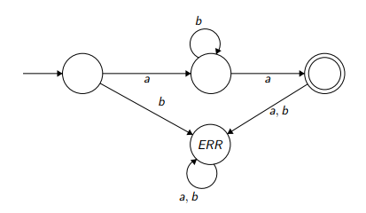

**CS 241, Lecture 6 - Deterministic Finite Automata**

Note that from this point on, I'm using "s" to define "\$" when within
code blocks.

Finite Languages and Membership
===============================

-   Recall us defining languages and words.

-   How can we efficiently determine membership for a finite language?
    This is the easiest case.

-   The naive way of doing it would be to check EVERY single word until
    we hit it or run through the entire list of words in the language.

-   More efficiently, though, we could basically use a structure like a
    trie, where we determine if a word is in a language based on the
    previous character.

-   For example:

    ``` {mathescape="" numbers="none" breaklines="true"}
    if char[0] == 'b' {
        if char[1] == 'a' {
            if char[2] == 'g' {
                accept();
            }
            else if char[2] == 't' {
                accept();
            }
            else if no_more_chars(char*) reject();
        }
        else if char[2] == 'e' {
            if char[3] == 't' {
                accept();
            }
            else if no_more_chars(char*) reject();
        }
    }
    else reject();
    ```

-   We can represent this pictorially:\
    

-   We place an arrow into the inital start state.

-   Accepting states are two circles.

-   Label your arrows from state to state.

-   In CS 241, we do not need to include error states. You'll need them
    for CS 360 though. If your bubble does not have a valid arrow
    leaving it, we assume that this means it will go into an error
    state.

Regular Languages
=================

-   A **regular language** over an alphabet $\sum$ consists of one of
    the following:

    1.  The empty language and the language consisting of the empty word
        are regular.

    2.  All languages $\{s\}$ for all $s \in \sum$ are regular.

    3.  The union, concatenation, or Kleene star of any two reg. lang.
        are also regular.

    4.  Nothing else.

-   Let $L, L_1, L_2$ be two reg. lang. Then the following are regular
    languages:

    -   Union:
        $L_1 \bigcup L_2 = \{x : x \in L_1 \text{ or } x \in L_2\}$

    -   Concatenation:
        $L_1 \cdot L_2 = L_1L_2 = \{xy : x \in L_1, y \in L_2\}$

    -   Kleene star:
        $L* = \{\epsilon\} \bigcup \{xy : x \in L*, y \in L\} = \bigcup_{n=0}^{\infty} L^n$\
        where
        $L^n = \begin{cases} \{\epsilon\} \text{ if } n = 0\\ LL^{n-1} \text{ otherwise}\end{cases}$

    -   Equivalently, $L*$ is the set of all strings consisting of 0 or
        more occurences of strings from $L$ concatenated together.

-   For example, suppose $L_1 =$ {up, down}, $L_2$ = {hill, load}, and
    $L = \{a, b\}$. Then:

    -   $L_1 \bigcup L_2 = \{\text{up, down, hill, load}\}$

    -   $L_1L_2 = \{\text{uphill, upload, downhill, download}\}$

    -   $L* = \{\epsilon, a, b, aa, ab, ba, bb, aaa, aab, aba, \dots\}$

-   Another sample question: Let $\sum = \{a, b\}$. Explain why
    $L = \{ab^na : n \in \mathbb{N}\}$ is regular.

-   **Solution:** Since $\{a\}$ is regular and $\{b\}*$ is also regular
    as $\{b\}$ is regular, then the concatenation of
    $\{a\} \cdot \{b\}* \cdot \{a\}$ is also regular.

-   A regular expression is basically a regular language as well. We
    just drop all the set notation.

    -   Union uses a pipe ($|$) now.

    -   Concationation is still $\cdot$ or just put them together.

    -   Kleene star stays the same.

    -   Order of operations: \* $>$ $\cdot$ $>$ $|$.

    -   For example, the previous example would translate to $ab*a$.

Deterministic Finite Automata
=============================

-   We can use our earlier pictorial representation to represent a
    regular language IF we allow our picture to include loops!

-   This is, of course, to support Kleene stars. For example:\
    

-   Or, if you're in CS 360:\
    

-   These machines are called **Deterministic Finite Automata (DFA):**

    -   A DFA is a 5-tuple ($\sum, Q, q_0, A, \delta$):

        -   $\sum$ is a finite non-empty set (alphabet)

        -   $Q$ is a finite non-empty set of states

        -   $q_0 \in Q$ is a start state

        -   $A \subseteq Q$ is a set of accepting states

        -   $\delta : (Q \times \sum) \rightarrow Q$ is our transition
            function - given a state and a symbol of our alphabet, which
            state do we go to? With no explicit arrows, this means, go
            to the error state.

-   For example, let's consider MIPS labels (Carmen forgot to add the
    image):\
    -\> \[q0\] -(a-z. A-Z)-\> \[q1\](loops with (a-z, A-Z, 0-9)) -(:)-\>
    \[\[q2\]\]

-   Let's try another DFA example. Write DFAs over $\sum = \{a, b\}$
    that:

    1.  Accepts only words with an even number of $a$'s

    2.  Accepts only words with an odd number of $a$'s and an even
        number of $b$'s

    3.  Accepts only words where the parity of the number of $a$'s is
        equal to that of the number of $b$'s

-   We'll do the third one:

    ``` {mathescape="" numbers="none" breaklines="true"}
            -> [even a, even b] -a-> [odd a, even b] <-b-> [odd a, odd b]
                      ^
                      |
                      b                                         ^
                      V                                         |
                [even a, odd b] -b-> [even a, even b] -----<--a-|
    ```

    \<++\>
