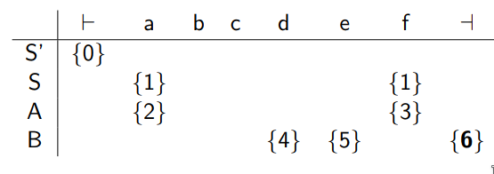

**CS 241, Lecture 11 - Top Down Parsing, First and Follow**

**Thurs, Feb 14, 2019**

Top Down Parsing
================

-   Given a CFG $G = (N, \Sigma, P, S)$ and a terminal string
    $w \in \Sigma^*$, we want to find the derivation - the steps s.t.
    $S \Rightarrow \dots \Rightarrow w$ or prove that $w \not\in L(G)$
    (just throw an error if so).

-   Top-down parsing says start from $S$ and try to get to $w$.

-   Bottom-up parsing says says to start with $w$ and try to see how we
    could get to $w$ in the first place.

-   We will first consider top-down parsing:

    -   We start with $S$ and store itermediate derivations in a stack,
        then match characters to $w$.

    -   Use a stack to do so.

    -   Every time we pop from stack, the consumed input and the reverse
        of the stack is equal to an intermediate step in our derivation.

    -   We augment our grammar top include $\vdash$ and $\dashv$ to
        symbolize the beginning and end of the file, respectively. We
        also use $S'$ to indicate a new start state.

    -   We can see the algorithm described as follows:\
        

    -   For example: $$\begin{aligned}
                            S &\rightarrow AcB (1)\\
                            A &\rightarrow ab (2)\\
                            A &\rightarrow ff (3)\\
                            B &\rightarrow def (4)\\
                            B &\rightarrow ef (5)
                        \end{aligned}$$ Determine if
        $w = abcdef \in L(G)$. We add a rule:
        $$S' \rightarrow \vdash S \dashv (0)$$ We want to look for
        $w = \vdash abcdef \dashv$ in this augmented grammar. This gives
        us the following parse table:\

                  Stack                    Read                    Processing                           Action
          --------------------- -------------------------- -------------------------- ------------------------------------------
                   S'                   $\epsilon$          $\vdash$ abcdef $\dashv$   Pop S', push $\dashv$, $\vdash$ (Rule 0)
           $\dashv$ S $\vdash$          $\epsilon$          $\vdash$ abcdef $\dashv$                Match $\vdash$
               $\dashv$ S                $\vdash$               abcdef $\dashv$              Pop S, push B, c, A (Rule 1)
              $\dashv$ BcA               $\vdash$               abcdef $\dashv$               Pop A, push b, a (Rule 2)
              $\dashv$ Bcba              $\vdash$               abcdef $\dashv$                        Match a
              $\dashv$ Bcb              $\vdash$ a               bcdef $\dashv$                        Match b
               $\dashv$ Bc             $\vdash$ ab               cdef $\dashv$                         Match c
               $\dashv$ B              $\vdash$ abc               def $\dashv$               Pop B, push f, e, d (Rule 4)
              $\dashv$ fed             $\vdash$ abc               def $\dashv$                         Match d
               $\dashv$ fe            $\vdash$ abcd               ef $\dashv$                          Match e
               $\dashv$ f             $\vdash$ abcde               f $\dashv$                          Match f
                $\dashv$             $\vdash$ abcdef                $\dashv$                        Match $\dashv$
               $\epsilon$        $\vdash$ abcdef $\dashv$          $\epsilon$           Accept, as stack = input = $\epsilon$

    -   When we popped $A$, we had multiple possible choices - which
        rule would we use?

    -   We construct a predictor table, using a single character that we
        look at, to tell us which rule to use. For our example, for $A$,
        if we see an $a$, then we use rule 2; if we see a $f$ then use
        rule 3.

    -   But this won't work if we have an element that contains more
        than one other element - for example, if we add a new rule
        $A \rightarrow adf$.

First and Follow
================

-   A $LL(1)$ grammar is one that each cell of the predictor tables
    contains at most **one** entry.

-   With an $LL(1)$ grammar, we can drop the set notation from the
    predictor table.

-   We call it $LL(1)$ as:

    -   First L: Scan left to right

    -   Second L: Leftmost derivations

    -   Number of symbols in lookahead: 1

-   Constructing the lookahead table - we define four functions:

    -   *Nullable*$(\beta) =$true iff $\beta \Rightarrow^* \epsilon$ and
        false otherwise

    -   *Follow*$(A) = \{b \in \Sigma' : S' \Rightarrow^* \alpha Ab \beta$
        for some $\alpha, \beta \in V^*\}$

    -   *Predict*$(A, a) = \{A \rightarrow \beta : a \in$
        *First*$(\beta)$}

    -   *First*$(\beta) = \{a \in \Sigma` : \beta \Rightarrow^* a\gamma$,
        for some $\gamma \in V^*\}$

-   More informally:

    -   *Nullable($\beta$)*: boolean function, for $\beta \in V^*$ is
        true iff $\beta \Rightarrow^* \epsilon$.

    -   *Follow(A)*: for any $A \in N'$, this is the set of elements of
        $\Sigma'$ that can come immediately after $A$ in a derivation
        starting from $S'$.

    -   *Predict(A, a)*: production rules that apply when $A \in N'$ is
        on the stack, and $a \in \Sigma'$ is the next input character.

    -   *First($\beta$)*: set of characters that can be the first letter
        of a derivation starting from $\beta \in V^*$.

-   Note our definition of *Predict* is not correct right now.

-   Our predict table looks like this:\
    

-   We can see *First* with our previous example:\
    

-   We say that a $\beta \in V^*$ is **nullable** iff
    *Nullable*($\beta$) = true

-   Redefine *Predict*$(A, a) =  \{A \rightarrow \beta : a \in$
    *First*$(\beta)\} \cup \{A \rightarrow \beta : \beta$ is nullable
    and $a \in$ *Follow(A)*}

-   Note this ALL only works well for $LL(1)$. We will make our grammar
    work with $LL(1)$, and thus, these rules!
