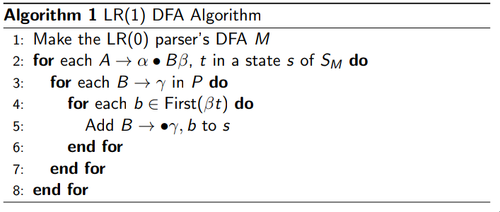
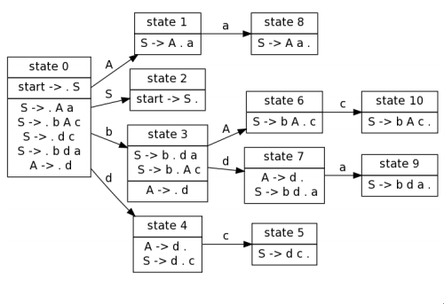
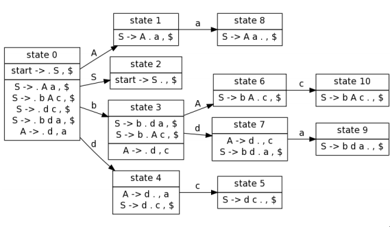
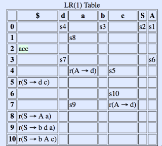

**CS 241, Lecture 14 - SLR(1) and LR(1) Parsers**

Bottom-up Parsing
=================

-   Knuth defines a theorem, that the set
    $\{wa: \exists x s.t. S \Rightarrow^* wax\}$, where $w$ is the stack
    and $a$ is the next character in a regular language.

-   Note that this is actually a DFA that also writes output - these are
    called finite state transducers.

-   Let us construct an LR(0) DFA with the following grammar:
    $$\begin{aligned}
                &S' \rightarrow \vdash S \dashv \\
                &S \rightarrow S + T \\
                &S \rightarrow T \\
                &T \rightarrow d
            \end{aligned}$$

-   From each state, for each rule, we move a "dot" forward by one
    character. For example, with $S' \rightarrow \cdot \vdash S \dashv$,
    we move the $\cdot$ over $\vdash$. The transition function consumes
    the $vdash$.

-   This leaves us with $S' \rightarrow \vdash \cdot S \dashv$. This
    state would also have $S \rightarrow \cdot S + T$ and
    $S \rightarrow \cdot T$.

-   We also need to consider, now, $T \rightarrow \cdot d$.

-   We are left with the following LR(0) grammar:\
    

-   To use this automation, start in a start state with an empty stack.
    Either:

    -   Shift: shift a character from input to the stack. Follow any
        transition that follows with the character as a label; if none,
        reduce or if not possible, give an error.

    -   Reduce: reduce states that only have one item and the $\cdot$ is
        in the rightmost position. Pop the RHS off the stack and
        backtrack in your DFA the number of states corresponding to the
        number of elements in the RHS. Follow the transition for the LHS
        and push the LHS on the stack.

-   Accept if $S'$ is on the stack and the index is empty.

-   For example, for string $\vdash d + d + d \dashv$:\
    

-   This, however, leaves issues on whether we should shift or reduce
    (shift-reduce) or *which* item to reduce (reduce-reduce).

-   We take the sledgehammer approach - ignore all grammars that have
    these problems!

-   We say a grammar is LR(0) iff after creating the Knuth transducer,
    no state has these conflicts!

-   We see that, like how LL(1) grammars were never left recursive, that
    LR(0) grammars are never right associative. For example, this
    grammar: $$\begin{aligned}
                &S' \rightarrow \vdash S \dashv \\
                &S \rightarrow T + S \\
                &S \rightarrow T \\
                &T \rightarrow d
            \end{aligned}$$

-   Observe the following resulting LR(0) automation:\
    \
    We see that state 5 has a shift-reduce conflict. We can fix this if
    our input instead began with $\vdash d$. This would give us a stack
    of $\vdash d$ which we reduce in state 6, so our stack changes from
    $\vdash T$ to state 5 via state 1.

-   But this still gives a problem\... we may want to reduce
    $S \rightarrow T$ depending on if the input is $\vdash d \dashv$ or
    $\vdash d + \dots$ (no to the latter).

-   We fix this with a lookahead. For every
    $A \rightarrow \alpha \cdot$, attach Follow($A$). We also do this
    for $S$ and $T$. So, state 5 would become
    $S \rightarrow T \cdot + S$ and $S \rightarrow T \cdot \{\dashv\}$.
    That is, apply the first rule if the next token is $+$ and apply the
    second rule if the next token is $\dashv$.

-   We call these parsers SLR(1) parsers - simple LR with 1 char.
    lookahead.

-   There exist LR(1) parsers, but instead of adding all of Follow($S$)
    to an item, we add a subset of this set to each item.

-   The algorithm for a LR(1) DFA is as follows, for $S_M$ being a set
    of states of a DFA $M$:\
    

-   Consider a sample LR(1) grammar that is **not** SLR(1):
    $$\begin{aligned}
                &S \rightarrow aA\\
                &S \rightarrow bAc\\
                &S \rightarrow dc\\
                &S \rightarrow bda\\
                &A \rightarrow d
            \end{aligned}$$ This gives a SLR(1) table as such:\
    \
    It also gives the SLR(1) table:\
    \
    Meanwhile, the LR(1) table is:\
    \
    Its accompanying LR(1) table:\
    
