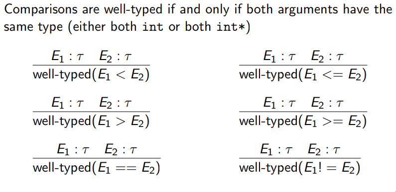
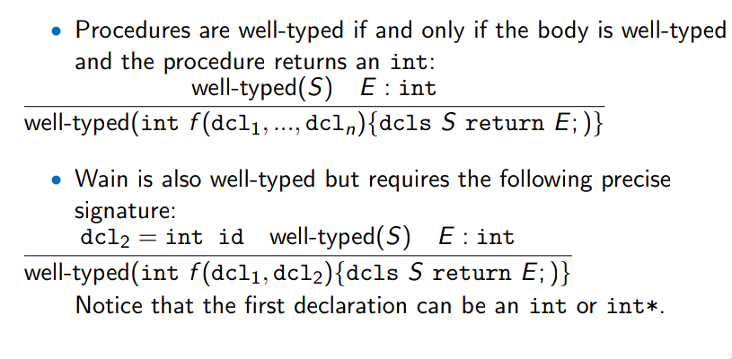

**CS 241, Lecture 16 - Type Checking and Code Generation**

Types (cont.)
=============

-   "The beginning of the end." - Carmen Bruni

-   We note that WLP4\... doesn't have booleans. How can we do loops and
    ifs then? Well, make sure for the grammar:

    ``` {mathescape="" numbers="none" breaklines="true"}
        while (T) {S}
        if (T) {S1} else {S2}
    ```

-   Make $T$ a boolean test of type "`expr comp expr`".

-   The inference rules, again:\
    \
    \
    \
    \
    \
    

-   Note for WAIN, we allow the first argument to be an int or int
    pointer, as we will always need the second arg to be an int (size of
    array in mips.array, int in mips.twoints)

-   We call anything that is a storage location an *lvalue*.

-   For us, lvalues are any of variable names, dereferenced pointers, or
    any parenthical combination of these. NOT integers.

-   This is forced by the WLP4 grammar so we don't really need to
    manually check this!

Code Generation
===============

-   We wrote code that translates WLP4 $\rightarrow$ to a grammar, and
    we have code that translates MIPS $\rightarrow$ binary. So we need
    to fill the missing link - grammar to MIPS.

-   We need to make sure our WLP4 and MIPS code do the same thing! This
    is the most important!

-   We also want it to be somewhat efficient - both by compile time and
    code itself, the latter of with we will measure this by number of
    lines.

-   Now, given the following code:

    ``` {mathescape="" numbers="none" breaklines="true"}
        int wain(int a, int b) {
            return a;
        }
    ```

    what is the MIPS command? Well:

    ``` {mathescape="" numbers="none" breaklines="true"}
        add $\$$3, $\$$1, $\$$0
        jr $\$$31
    ```

-   But there's a *slight* problem - if we wanted to return b instead,
    then the *parse tree* of both functions would be identical!

-   Luckily, we have a symbol table! We will augment it to also include
    where each symbol is stored:\
    \

       Symbol   Type   Location
      -------- ------ ----------
         a      int     $\$1$
         b      int     $\$2$

    \

-   But\... if we keep storing variables and parameters in registers, we
    *will* run out of registers - especially recursive code! Therefore,
    we're back to our old friend, the **stack**.

-   So, our old code now for a basic wain program becomes (note I got
    lazy and used "s" instead of "\$"):

    ``` {mathescape="" numbers="none" breaklines="true"}
        sw s1, -4(s30)
        sw s2, -8(s30)
        lis s4
        .word 4
        sub s30, s30, s4
        sub s30, s30, s4
        lw s3, 4(s30)
        add s30, s30, s4
        add s30, s30, s4
        jr s31
    ```

-   Note by convention, $\$4$ contains the integer 4.

-   Also, we will now instead make the symbol table store the *offset*
    from the stack pointer:\
    \

       Symbol   Type   Offset from $\$30$
      -------- ------ --------------------
         a      int            4
         b      int            0

    \

-   Variables also have to go on the stack, but we don't know what the
    offsets will be until we process all the variables and
    parameters\... consider the following code and accompanying MIPS
    program:

    ``` {mathescape="" numbers="none" breaklines="true"}
        int wain (int a, int b) {
            int c = 0;
            return a;
        }
    ```

    ``` {mathescape="" numbers="none" breaklines="true"}
        sw s1, -4(s30)
        sw s2, -8(s30)
        lis s4
        .word 4
        sub s30, s30, s4
        sub s30, s30, s4
        sub s30, s30, s4  ; For int c
        sw s0, 0(s30)     ; c = 0
        lw s3, 8(s30)     ; 8 from the symbol table
        add s30, s30, s4 
        add s30, s30, s4
        add s30, s30, s4  ; We could probably speed this part up
        jr s31
    ```

-   But this isn't enough\... what if we have more variables? What do we
    do? Change all our offsets every time?

-   Remember \$30 represents the *top* of the stack - and \$29
    represents the *bottom* of the stack! We will use \$29 to calculate
    our offsets, as no matter how far we move the top of the stack, the
    offsets from \$29 will remain unchanged!
