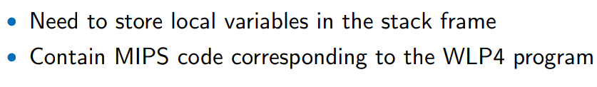

**CS 241, Lecture 17 - Code Generation**

Warm-up
=======

Consider the following WLP4 program, and write an equivalent MIPS
program:

``` {mathescape="" numbers="none" breaklines="true"}
    int wain(int a, int b) {
        int c = a + b;
        return c * a;
    }
```

This code is valid and equivalent:

``` {mathescape="" numbers="none" breaklines="true"}
    sw s1, -4(s30)
    sw s2, -8(s3)
    lis s4
    .word 4
    sub s30, s30, s4
    sub s30, s30, s4
    sub s30, s30, s4
    sw s0, 0(s30)
    lw s3, 8(s30)
    add s30, s30, s4
    add s30, s30, s4
    add s30, s30, s4
    jr s31
```

Code Generation - Continued
===========================

-   Recall our previous problem - that variables also have to go on the
    stack but we don't know what the offsets will be until we process
    ALL the variables and parameters if we use \$30 and offset from the
    top of the stack frame.

-   Instead, we offset not from \$30, but \$29 - it now comes in use!
    Remember that \$29 keeps track of the **bottom** of the stack frame!
    (note in normal MIPS, \$29 and \$30 are switched in functionality)

-   We calculate offsets from \$29, which never changes, while \$30
    does.

-   So we can generate the following equivalent code:

    ``` {mathescape="" numbers="none" breaklines="true"}
    int wain(int a, int b) { int c = 0; return a; }

    lis s4
    .word 4
    sub s29, s30, s4
    sw s1, -4(s30)
    sub s30, s30, s4
    sw s2, -4(s30)
    sub s30, s30, s4
    sw s0, -4(s30)   ; For int c = 0
    sub s30, s30, s4
    lw s3, 0(s29)    ; Offset in symbol table
    add s30, s30, s4
    add s30, s30, s4
    add s30, s30, s4
    jr s31
    ```

-   This corresponds to the following *new* offset table:\

       Symbol   Type   Offset from \$29
      -------- ------ ------------------
         a      int           0
         b      int           -4
         c      int           -8

    \

-   This is versus our *old* offset table:\

       Symbol   Type   Offset from \$30
      -------- ------ ------------------
         a      int           8
         b      int           4
         c      int           0

    \

-   This also allows us to handle intermediate values of complicated
    arithmetic expressions by storing them on the stack, which would be
    impossible to feasibly do if relying on \$30.

-   For example, what about a more complicated program?

    ``` {mathescape="" numbers="none" breaklines="true"}
    int wain(int a, int b) {
        return a - b;
    }
    ```

-   Well, we already have the convention that \$3 stsores the output so
    we can use this for scratch work in between. But this isn't enough -
    we need to load both a *and* b.

-   For convention, we also state \$5 stores intermediate work.

-   Then, we could generate the following MIPS code:

    ``` {mathescape="" numbers="none" breaklines="true"}
    lis s4
    .word 4
    sub s29, s30, s4
    sw s1, -4(s30)
    sub s30, s30, s4
    sw s2, -4(s30)
    sub s30, s30, s4
    lw s3, 0(s29)    ; Offset in symbol table (a)
    add s5, s3, s0   ; Store a in s5
    lw s3, -4(s29)   ; Offset in symbol table (b)
    sub s3, s5, s3
    add s30, s30, s4 ; Restore stack 
    add s30, s30, s4
    jr s31
    ```

-   However, things aren't all fine here - this approach breaks if we
    consider something like $a + (b - c)$. We need to load $a$, then
    load $b$, then load $c$, compute $b - c$, then compute the final
    answer. This needs **three** registers - and what will we do if we,
    say, add a fourth value $d$? Four registers? Five?

-   Instead, we will once again turn to our lord and saviour, the stack.
    This way, we will only ever need two registers for scratch work!

-   Our new code for the previous question:

    ``` {mathescape="" numbers="none" breaklines="true"}
    int wain(int a, int b) { return a - b; }

    lis s4
    .word 4
    sub s29, s30, s4
    sw s1, -4(s30)
    sub s30, s30, s4
    sw s2, -4(s30)
    sub s30, s30, s4
    lw s3, 0(s29)       ; offset in symbol table (a)
    sw s3, -4(s30)
    sub s30, s30, s4    ; push a on stack
    lw s3, -4(s29)      ; offset in symbol table (b)
    add s30, s30, s4
    lw s5, -4(s30)      ; pop from stack
    sub s3, s5, s3
    jr s31
    ```

-   We use some shorthand for our code for simplicity. We state:

    ``` {mathescape="" numbers="none" breaklines="true"}
    code(a):
    lw s3, N(s29)  ; N is the offset in the symbol table

    push(s3):
    sw s3, -4(s30)
    sub s30, s30, s4

    pop(s5):
    add s30, s30, s4
    lw s5, -4(s30)
    ```

    We are trying to find a function code(s) for every possible value in
    our grammar.

-   For example:

    ``` {mathescape="" numbers="none" breaklines="true"}
    int wain(int a, int b) {
        int c = 3;
        return a + (b - c);
    }

    lis s4
    .word 4
    sub s29, s30, s4
    push(s1)
    push(s2)
    lis s5
    .word 3
    push(s5)
    code(a)             ; Load a in s3
    push(s3)            
    code(b)             ; s3 <- b
    push(s3)
    code(c)             ; s3 <- c
    pop(s5)             ; s5 <- b
    sub s3, s5, s3      ; s3 <- b - c
    pop(s5)             ; a <- s5
    add s3,s5, s3       ; s3 <- a + (b - c)
    jr s31
    ```

-   We can generalize this technique so that we only need one extra
    register to store our components.

-   We can generalize the above to our grammar. Remember the rule
    $exprA exprB PLUS term$? Then, we have:

    ``` {mathescape="" numbers="none" breaklines="true"}
    exprA exprB PLUS term

    code(exprA) = code(exprB) + push(s3) +
                  code(term) + pop(s5) +
                  add s3, s5, s3
    ```

-   Note that above for the add command, term is in \$3 and expr is in
    \$5.

-   Singleton grammars are easy to translate:

    ``` {mathescape="" numbers="none" breaklines="true"}
    S -> BOF procedure EOF:
    code(S) = code(procedure)

    expr -> term:
    code(expr) = code(term)
    ```

-   Assignments are also not too bad for IDs (pointers are harder) (note
    N is the offset for exprA):

    ``` {mathescape="" numbers="none" breaklines="true"}
    statement -> exprA BECOMES exprB SEMI: (if exprA is an ID):
    code(statement) = code(exprB) + sw s3, N(s29) ; s3 <- exprB
    ```

Importing Code and MERL
=======================

-   A compiler needs to take lots of code from many different parts to
    work.

-   We define a *runtime environment (RTE)* as the execution environment
    provided to an application or software by the OS to assist programs
    in their execution, such as procedures, libraries, environment
    variables, etc.

-   An example is msvcrt.dll, a module containing standard C library
    functions such as printf, memcpy, and so on, on Windows (for Linux
    this is libc.so).

-   Therefore, it makes sense to provide print as part of the runtime.

-   We are given MERL (MIPS Executable RElocatable Linkable) files.

-   When we compile code, almost always what is output is not pure
    machine code - there is often some additional header information as
    well. The object is usually *object code*.

-   These files can help us store additional information needed by the
    loader and linker.

-   For example, we are provded with a print.merl file that we link with
    our assembled output:

    ``` {mathescape="" numbers="none" breaklines="true"}
    ./wlp4gen < source.wlp4 > source.asm
    cs241.linkasm < source.asm > source.merl
    linker source.merl print.merl > exec.mips
    ```

-   Upon reaching the .mips file, we can call mips.twoints or
    mips.array! We made it!

-   To use print, we need to add .import print to the beginning of our
    file. After this, we can print in our MIPS code! It will print the
    contents of \$1, so you may need to save \$1 depending on waht you
    want.

-   print also overwrites \$31! We need to save and restore it! The code
    thus looks like

    ``` {mathescape="" numbers="none" breaklines="true"}
    code(println(expr);) = code(expr) + 
                           add s1, s3, s0 +
                           push (s31) +
                           lis s5 + .word print +
                           jalr s5 + pop(s31)
                           (+ lw s1, 0(s29)) ; depends on whether we stored this or not
    ```

-   Which means that we've actually completed most of our statements,
    except for if, while, and delete!

-   For the former two, we need to handle boolean tests\...

-   By convention, store "1" in \$11, so we have true and false stored
    somewhere.

-   Also, store print in \$10.

-   Our code structure therefore looks like this:

    ``` {mathescape="" numbers="none" breaklines="true"}
    ;Prologue
    .import print
    lis s4
    .word 4
    lis s10
    .word print
    lis s11
    .word 1
    sub s29, s30, s4
    ;end Prologue, begin Body
    ; space for variables
    translated WLP4 code
    ;end Body and begin Epilogue
    add s30, s29, 4
    jr s31
    ```

Boolean Tests, If, While
========================

-   How would we test a LT?

    ``` {mathescape="" numbers="none" breaklines="true"}
    test -> exprA < exprB:
    code(test) = code(exprA) +
                 push(s3) + 
                 code(exprB) +
                 pop(s5) +
                 slt s3, s5, s3
    ```

-   Likewise, for GT:

    ``` {mathescape="" numbers="none" breaklines="true"}
    test -> exprA < exprB:
    code(test) = code(exprA) +
                 push(s3) + 
                 code(exprB) +
                 pop(s5) +
                 slt s3, s3, s5 ; Flip s3 and s5
    ```

-   For NE:

    ``` {mathescape="" numbers="none" breaklines="true"}
    test -> exprA < exprB:
    code(test) = code(exprA) +
                 push(s3) + 
                 code(exprB) +
                 pop(s5) +
                 ;maybe store s6 and s7 if used
                 slt s6, s3, s5 +
                 slt s7, s5, s3 +
                 ; Note 0 <= s6 + s7 <= 1
                 add s3, s6, s7
    ```

-   To do EQ, remember that $a == b$ is the same as $!(a != b)$, so we
    just need to negate our $!=$ result!:

    ``` {mathescape="" numbers="none" breaklines="true"}
    test -> exprA < exprB:
    code(test) = code(exprA) +
                 push(s3) + 
                 code(exprB) +
                 pop(s5) +
                 ;maybe store s6 and s7 if used
                 slt s6, s3, s5 +
                 slt s7, s5, s3 +
                 ; Note 0 <= s6 + s7 <= 1
                 add s3, s6, s7
                 sub s3, s11, s3 ; Flip 0 to 1 and v.v.
    ```

-   How about LEQ and GEQ? Well, for LEQ, use the idea that $(a \leq b)$
    is the same as $!(a > b)$. The same holds for GEQ.

-   So we've covered all our tests! Now to translate IF statements:

    ``` {mathescape="" numbers="none" breaklines="true"}
    statement -> IF (test) {statements} ELSE {statements}:
    code(statement) = code(test) +
                      beq s3, s0, else +
                      code(stmts1) +
                      beq s0, s0, endif +
                      else: code(stmts2) + 
                      endif :
    ```

-   But there may be problems with multiple labels\... how can we fix
    this?

-   Easy! Keep track of how many if statements we have with some
    counter. Use label names like "else\#" and "endif\#" to keep track
    of which label we're on! We did this with rustcc too.

-   How about WHILE?

    ``` {mathescape="" numbers="none" breaklines="true"}
    statement -> WHILE (test) {statements}:
    code(statement) = loop: code(test) +
                      beq s3, s0, endWhile +
                      code(stmts) +
                      beq s0, s0, loop +
                      endWhile:
    ```

-   Like IF, we need a while loop counter to track our while loops and
    label them accordingly!

-   Note that we can generate COMMENTS with our MIPS code - DO THIS!
    This will help a lot in deciphering wtf is going on with your
    generated code (remember this did WONDERS with rustcc).

Recap
=====

**Conventions:**\
\
\
**Prologue:**\
\
\
**Body:**\
\
\
**Epilogue:**\
\
\
