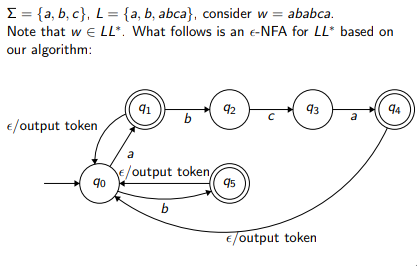
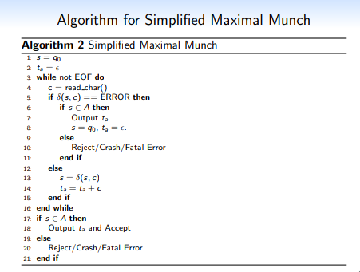
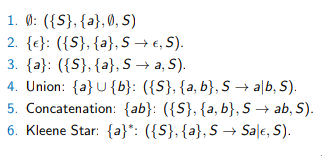

**CS 241, Lecture 9 - Maximal Munch and Context Free Grammars**

**Tues, Feb 05, 2019**

Maximal Munch and Simplified Maximal Munch
==========================================

-   The general idea is to consume the largest possible token that makes
    sense, then produce the token and then proceed.

-   Maximal munch differs from simplified maximal munch:

    -   Maximal munch consumes chars until there is no valid transition.
        If there are still characters, backtrack to the last valid
        accepting state and resume.

    -   Simplified maximal munch consumes chars until there is no longer
        a valid transition. If the state is accepting, produce the token
        and proceed. Otherwise go to error state.

-   Observe the following DFA for $w$ = "ababca":\
    

-   With SMM, when we hit the second "a", we stop and output an error,
    which is not the correct answer.

-   With MM, the second "a" is reached, and the last accepting state was
    "a". We backtrack back to "a" and resume munch (go back to $q_0$,
    resume by consuming "b". We would have to keep track of the last
    accepting state.

-   Note SMM is usually good enough and thus we typically use this
    without issue - that is, we make our language work with SMM rather
    than the other way around.

-   Examples of the MM and SMM algorithms:\
    \
    

-   This concludes the process of scanning.

Syntactic Analysis - Context-Free Grammars
==========================================

-   Things we have to consider: syntax (is the order of tokens correct,
    are parentheses balanced?) and semantics (does what is written make
    sense?).

-   A **grammar** is the language of languages - they help us describe
    what we are and are not allowed to say.

-   **Context-free grammars** is a 4-tuple $(N, \Sigma, P, S)$ where:

    -   $N$ is a finite non-empty set of non-terminal symbols (symbols
        you cannot stop on)

    -   $\Sigma$ is an alphabet, or in other words a set of non-empty
        terminal symbols, and $N \hat Z = \emptyset$.

    -   $P$ is a finite set of productions, each of the form
        $A \rightarrow \beta$ where $A \in N$ and
        $\beta \in (N \cup \Sigma)*$.

    -   $S \in N$ is a starting symbol.

-   We set $V = N \cup \Sigma$ to denote the vocabulary - the set of
    *all* symbols in our language.

-   For example, in rustcc, we defined various CFGs, such as Fn
    containing BlockItems which contained Statements or Declarations
    which contained\...

-   **Conventions**:

    -   Lower case letters from the start of the alphabet are elements
        of $\Sigma$

    -   Lower case letters from the end of the alphabet are elements of
        $\Sigma^*$ (words)

    -   Upper case letters from the start of the alphabet are elements
        of $N$

    -   $S$ is always our start symbol

    -   Greek letters like $\alpha, \beta, \gamma$ are elements of
        $V^* = (N \cup \Sigma)^*$.

-   For example, consider $\Sigma = \{(, )\}$, and let
    $L = \{w : w \text{ is a balance string of parentheses}\}$. Thus,
    $S \rightarrow \epsilon, S \rightarrow (S), S \rightarrow SS \Rightarrow S \rightarrow \epsilon | (S) | SS$

-   A **derivation** over a CFG$(N, \Sigma, P, S)$ is such that:

    -   $\alpha$ derives $\beta$ and we write $\alpha \Rightarrow \beta$
        iff $\beta$ can be obtained from $\alpha$ using a rule from $P$.

    -   $\alpha A \beta \Rightarrow \alpha \gamma \beta$ iff there is a
        rule $A \rightarrow \gamma$ in $P$.

    -   $\alpha \Rightarrow^* \beta$ iff a derivation exists, that is,
        there exists $\delta_i \in V^*$ for $0 \leq i \leq k$ such that
        $\alpha = \delta_0 \Rightarrow \delta_1 \Rightarrow \dots \Rightarrow \delta_k = \beta$.
        Note $k$ can be 0.

-   Another example: find a derivation of (()()). Recall our above CFG:
    $$\begin{aligned}
                S & \Rightarrow (S) \Rightarrow (SS) \Rightarrow ((S)S) \\
                  & \Rightarrow ((S)(S)) \Rightarrow ((\epsilon)(S)) \\
                  & \Rightarrow (()()) \\
                S & \Rightarrow^* (()()) \quad\text{, short form for the above implications}
            \end{aligned}$$

-   Why is it "context-free"? It's because our grammar does not care for
    the context - that is, it does not care for *where* your symbols
    are.

-   This is the opposite of **context-bounded grammars**, which is where
    the context of the other symbols around other symbols *will* affect
    our productions (note we don't *really* need to know about this)

-   We define the **language** of a CFG$(N, \Sigma, P, S)$ to be
    $L(G) = \{w \in \Sigma^* : S \Rightarrow^* w\}$.

-   A language is **context-free** iff there exists a CFG $G$ such that
    $L = L(G)$.

-   Informally, we can show regular languages are context-free:\
    
