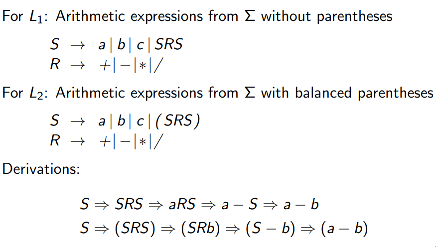
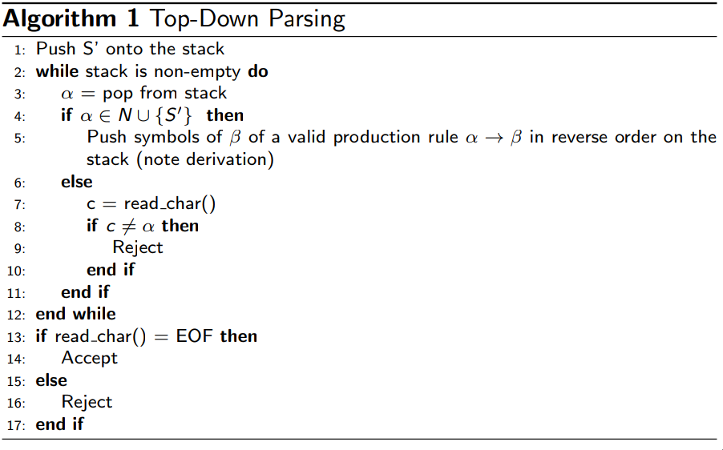

**CS 241, Lecture 10 - Context Free Grammars, Parse Trees, and Parsing**

**Thurs, Feb 07, 2019**

CFGs
====

-   Consider the arithmetic operations over
    $\Sigma = \{a, b, c, +, -, *, /, (, )\}$. Find a CFG for the
    following:

    -   $L_1$: Arithmetic expressions from $\Sigma$ without parentheses

    -   $L_2$: Well formed arithmetic expressions from $\Sigma$ with
        balanced parentheses

    Also, find a derivation for $a - b$ in the first language and for
    $(a - b)$ in the second one.

-   Solutions:\
    

-   Using the above language, let us create a **parse tree** for the
    input of $a-b$:\
    

-   Another example: using $aaabbb$ in $S \rightarrow \epsilon | aSb$ :\
    

-   We note that for every left/right-most derivation, there exists a
    unique parse tree, and vice versa.

-   We also note that given a grammar, every left/right derivation for a
    string is NOT unique. For example, consider two left-most
    $a - b * c$:\
    \
    

-   We define a grammar for which some word has more than one distinct
    leftmost/rightmost derivation/parse tree is called an **ambiguous
    grammar**. Our example above is an ambiguous example.

-   So how can we remove ambiguity? Well, we covered this in rustcc -
    create *precedence* to force your parse tree to understand, say,
    $a - b * c$ as $a - (b * c)$, NOT $(a - b) * c$!

-   This make it unambiguous. This is what $L_2$ does in our earlier
    example.

-   What we can also do is insist on what associativity we are using
    (ie: force right associatve grammar for $a - b * c$.

-   If $L$ is a context-free language, is there always an unambiguous
    grammar s.t. $L(G) = L$? No!

-   Can we write a computer program to recognize whether a grammar is
    ambiguous or not? No!

-   This means that given two CFGs $G_1$ and $G_2$, we cannot determine
    if $L(G_1) == L(G_2)$ or even something easier like
    $L(G_1) \hat L(G_2) = \varnothing$. They are both undecideable
    problems.

-   What we *can* do is use pushdown automation, which are just machines
    that are basically DFAs with an additional stack that we can process
    in LIFO order.

-   But we also need to find the **derivation** - finding this
    derivation is called **parsing**.

Parsing
=======

-   Top-down Parsing:

    -   Start with $S$ and store intermediate derivations in a stack,
        and match characters to $w$.

    -   Then every time we pop from the stack, we will have that
        consumed input $+$ reverse of stack is equal to a intermediate
        step in our derivation - that is, a step is an $\alpha_i$ where
        $S \Rightarrow \dots \Rightarrow \alpha_i \Rightarrow \dots \Rightarrow w$.

    -   We will augment our grammar to include $\vdash$ and $\dashv$
        symbolizing the beginning and end of the file. We also include a
        new start state, $S'$, to begin our parsing.

    -   Our original CFG $G = (N, \Sigma, P, S)$ becomes
        $$\begin{aligned}
                        G = (N \cup \{S'\}, \Sigma \cup \{\vdash, \dashv\}, P \cup \{S' \rightarrow \vdash S \dashv\}, S')
                        \end{aligned}$$

    -   The algorithm can be coded as follows:\
        

-   Example: Let us determine whether or not $w = abcdef$ is inside
    $L(G)$ where $$G = (\{S, A, B\}, \{a, b, c, d, e, f\}, P, S)$$ is
    defined with P given by: $$\begin{aligned}
                S &\rightarrow AcB \\
                A &\rightarrow ab\\
                A &\rightarrow ff\\
                B &\rightarrow def\\
                B &\rightarrow ef 
            \end{aligned}$$

-   Solution: We first augment the grammar with
    $S' \rightarrow \vdash S \dashv$, and look for
    $w = \vdash abcdef \dashv$ in this augmented grammar:\
    

Correction
==========

-   Determining if $L(G) = \not0$ is decideable.
