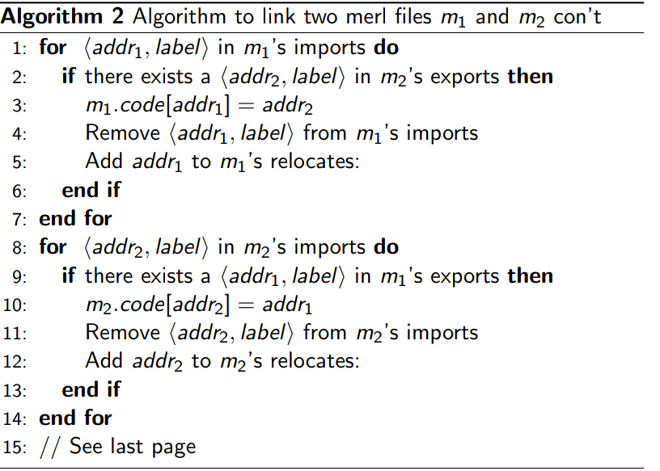

**CS 241, Lecture 22: Heap Management and Loaders**

Heap
====

-   The **Binary Buddy System**: we start with, say, 512 bytes of heap
    memory. Suppose we try to allocate 19 bytes. We need one more for
    bookkeeping, so we allocate 20 bytes. This fits in a block size of
    $2^5 = 32$ bytes. So we spolit our memory until we find such a
    block, and reserve the entire block.

-   So our block starts like $[512]$ and ends with
    $[\textbf{32}|32|64|128|256]$ (bold is reserved).

-   Now let's next request 63 bytes (which requires 64 bytes of space).
    This gives us something along the lines of
    $[\textbf{32}|32|\textbf{64}|128|256]$

-   Now let's request 40 bytes --- as we know, this becomes 41 bytes. We
    need a 64 byte block we don't have, so we split the 128 block and
    get: $[\textbf{32}|32|\textbf{64}|\textbf{64}|64|256]$

-   Now let's free the 63 block. We get:
    $[\textbf{32}|32|64|\textbf{64}|64|256]$

-   Now free the 19 byte block, giving us
    $[32|32|64|\textbf{64}|64|256]$. We can collapse 32 and it's
    neighbouring buddy, giving us $[64|64|\textbf{64}|64|256]$, from
    which we can then collapse into $[128|\textbf{64}|64|256]$.

-   Now finally, free the 40 byte block, giving us $[128|64|64|256]$,
    which we repeatedly collapse to get our original $[256]$ block of
    memory.

-   Some languages are nice, and they provide automatic memory
    management, like Java. How is this done?

-   One technique is **reference counting**. The idea is that for each
    heap block, keep track of the number of pointers that point to it.

-   We must watch every pointer and update reference counts each time a
    pointer is reassigned.

-   If a block's reference count reaches 0, reclaim it.

-   If a block points to another block and vice versa (and nothing
    points to the cluster), then the cluster is unreachable and should
    be cleaned.

-   Another technique is **marking and sweeping**. Here, we scan the
    entire stack and global variables, and search for pointers. We mark
    the heap blocks that have pointers to them. We then scan the heap
    and reclaim any blocks that aren't marked.

-   Essentially, this is a graph traversal problem.

-   A third technique is **copying the collector**. The idea is to split
    the heap into two halves, say, $H_1$ and $H_2$. Allocate memory in
    $H_1$, and when it is full or we cannot find enough memory, copy
    $H_1$ into $H_2$.

-   After the copy, $H_2$ has all the memory stored contiguously. Then,
    from now on, allocate to $H_2$ (in essence, flip the roles of $H_1$
    and $H_2$).

-   This leaves no fragmentation, and `new` and `delete` are very quick
    --- but we can only use half the heap at a time!

-   A more common variant is to split the heap into 3 or 4 regions, and
    reserve one region for the copy step instead.

Loaders
=======

-   Let's write the dumbest but techinically correct operating system:

    ``` {mathescape="" numbers="none" breaklines="true"}
    repeat:
        P <- next program to run
        copy P into memory at 0x0
        jalr $\$$0
        beq $\$$0, $\$$0, repeat
    ```

    Note that this is how `mips.twoints` and `mips.array` work.

-   The operating system is a program that needs to be in memory ---
    where should it be?

-   We let the loader deside instead of choosing different addresses at
    assembly time, which may lead to collisions.

-   So the loader's job is to:

    -   Take a program $P$ as input

    -   Find a location $\alpha$ in memory for $P$

    -   Copy $P$ to memory, starting at $\alpha$

    -   Return $\alpha$ to the OS

-   Introducing our OS, version 2.0:

    ``` {mathescape="" numbers="none" breaklines="true"}
    repeat:
        P <- next program to run
        $\$$3 <- loader(P)
        jalr $\$$3
        beq $\$$0, $\$$0, repeat
    ```

-   Our input is machine code in the form of words, from $w_1$ to $w_k$.
    Note that $n = k + stack_space$, which is how much space we keep for
    the stack (if the name wasn't self-explanatory)

-   This gives us code like:

    ``` {mathescape="" numbers="none" breaklines="true"}
    for i from i to k:
        MEM[alpha + 4 * i] = w_i
    $\$$30 <- alpha + 4 * n
    return alpha
    ```

    Unfortunately, there are some issues with this approach: labels may
    be resolved to incorrect addresses!

-   So to solve this, we might do something like:

    ``` {mathescape="" numbers="none" breaklines="true"}
    .word id <- need to add alpha to id
    .word constant <- do not reallocate!
    branching commands etc. <- do not reallocate!
    ```

-   But recall that we need to translate assembly code into machine
    code. So given `0x00000018`, is this a `.word constant` or a
    `.word id`? We don't know!

-   Introducing OS 3.0:

    ``` {mathescape="" numbers="none" breaklines="true"}
    repeat:
        P <- next program to run
        $\$$3 <- load_and_relocate(P)  ;note that we haven't determined how to relocate
        jalr $\$$3
        beq $\$$0, $\$$0, repeat
    ```

-   Usually, the output of assemblers is not pure machine code, it's
    object code.

-   We see this in our MERL(MIPS Executable Relocatable Linkable) files.

-   In this file, we need the code, location of `.word id`, and some
    auxiliary information.

-   So for example:

    ``` {mathescape="" numbers="none" breaklines="true"}
    beq $\$$0, $\$$0, 2
    .word endfile ;file length
    .word endcode ;code + header
    ;Insert MIPS Assembly here
    .word 0x4 ;constant no relocation
    .word 0x8 ;constant no relocation
    .word A ;needs relocation
    B: jr $\$$31
    A: beq $\$$0, $\$$, B ;no relocation
    endcode:    ;MERL symbol table
    .word 0x1   ;format code 1 means relocate
    .word 0x14  ;location of A
    endfile:
    ```

-   Note this requires two passes - the first pass records the size of
    the file, starts counting address at 0x0c instead of 0x0, and record
    the location of `.word id` instructions. The second pass outputs the
    header, MIPS machine code, and relocation table.

-   Note that even with this, it is possible to write code that only
    works at address 0. For example:

    ``` {mathescape="" numbers="none" breaklines="true"}
    lis $\$$2
    .word 12
    jr $\$$2
    jr $\$$31
    ```

    We should never encode address as anything other than labels, so
    that your loader can update the references --- that is, **NEVER
    hardcode addresses**!

-   our loader relocation algorithm is as follows:

    ``` {mathescape="" numbers="none" breaklines="true"}
    read_line() // skip cookie
    endMod <-- read_line() // end of MERL file
    codeLen <- read_line - 12 // no header in codeLen
    alpha <- findFreeRAM(codeLen)
    for (int i = 0; i < codeLen; ++i) 
        MEM[alpha + i] <- read_line()
    i <- codeLen + 12 // start of relocation table
    while (i < endMod)
        format <- read_line()
        if (Format == 1)
            rel <- read_line()
            // go forward by alpha and back by header len
            // alpha + rel - 12 since we don't load header
            MEM[alpha + rel - 12] += alpha - 12
        else
            ERROR
        i += 8
    ```

-   How do we resolve situations where we have labels in different
    files?

-   We could `cat` all such files together, but why should we reassemble
    these files more than once?

-   A better solution is the assemble the files first, **then**
    cat$\cdot$ right?

-   But remember only one piece can be at `0x0` at a time --- so those
    assembled files need to be MERL files, and not just MIPS files.

-   Note that concatenating two MERL files does not give a valid MERL
    file!

-   More doom! We haven't really resolved the issue with labels in
    different files.

-   We need to modify our assembler --- when we encounter a `.word`
    where the label is not in the file, we need to print a placeholder,
    `0x0` in our case, and indicate that we cannot run this program
    until our value of the `id` is given.

-   For example, consider the following two `.asm` files:

    ``` {mathescape="" numbers="none" breaklines="true"}
    a.asm:

    lis $\$$3
    .word label

    ===

    b.asm:

    label: sw $\$$5, -4($\$$30)
    ```

    where we cannot run `a.asm` without linking with `b.asm`

-   We need to extend our MERL file so that it can notify us when we
    need to assemble with multiple files.

-   Now let's consider another (related) thing --- error checking. Let's
    say we had a typo:

    ``` {mathescape="" numbers="none" breaklines="true"}
    lis $\$$3
    .word banana
    bananas:
    ```

-   Did we make a mistake? How do we recognize this error? Without any
    changes, our assembler might believe this label, `banana`, exists
    elsewhere and load this with a placeholder --- this might not be
    desired!

-   How do we tell our assembler what is an error and what is
    intentional?

-   `.import id` is the command which asks for which `id` we should be
    linking in.

-   This does not assemble to a word of MIPS.

-   Errors will occur if the label `id` is not in the current file and
    there is no `.import id` in the file.

-   We need to add entries in the MERL symbol table, and include format
    code `0x11` for External Symbol Reference(ESR).

-   What needs to be in an ESR entry?

    -   Where the symbol is being used

    -   The name of said symbol

    For example:

    ``` {mathescape="" numbers="none" breaklines="true"}
    0x11 ;format code
    ;location used
    ;length of the name in symbol (n)
    ;1st ASCII char of the name of symbol
    ;2nd ASCII char of the name of symbol
    ...
    ;nth ASCII char of the name of symbol
    ```

-   Another fun problem --- what if lables are duplicated. We wouldn't
    want to export a label in this situation --- this is why we have the
    `.export` directive.

-   `.export label` makes `label` avaliable for linking with other
    files. Like import, it doesn't translate to a word in MIPS, but
    rather tell the assembler to make an entry in the MERL symbol table.

-   The assembler makes an ESD, or an External Symbol Definition, for
    these words, following the format:

    ``` {mathescape="" numbers="none" breaklines="true"}
    0x05 ;format code
    ;address the symbol represents
    ;length of name of symbol(n)
    ;1st ASCII char
    ...
    ;nth ASCII char
    ```

-   Now, our MERL file contains the code, the address that needs
    relocating, as well as the addresses and names of every ESR and ESD.
    Our linker is complete.

-   Linker algorithm:\
    \
    \
    
