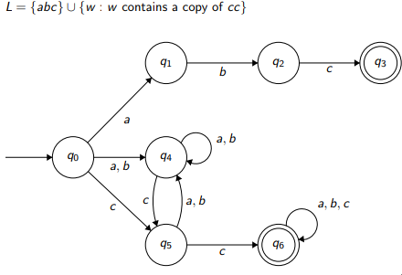

**CS 241, Lecture 8 - Non-Deterministic Finite Automata**

Non-Deterministic Finite Automata
=================================

-   An **NFA** is a 5-tuple: $(\sigma, Q, q_0, A, \delta)$:

    -   $\Sigma$ is a finite non-empty set (alphabet)

    -   $Q$ is a finite non-empty set of states

    -   $q_0 \in Q$ is a start state

    -   $A \subseteq Q$ is a set of accepting states

    -   $\delta : (Q \times \Sigma) \rightarrow 2^Q$ is our total
        transition function, denoting ther *power set* of $Q$

-   We can extend $\delta$ to
    $\delta^* : (2^Q \times \Sigma^*) \rightarrow 2^Q$:
    $$\begin{aligned}
                \delta^* : (2^Q \times \Sigma^*) &\rightarrow 2^Q \\
                (S, \epsilon) &\rightarrow S \\
                (S, a) &\rightarrow \delta^* (\cup_{q\in S} \delta (q, a), w)
            \end{aligned}$$ where $a \in \Sigma$.

-   In other words, an NFA given by $M = (\Sigma, Q, q_0, A, \delta)$
    **accepts a string** $w$ iff
    $\delta^* (\{q_0\}, w) \cup A \not= \varnothing$.

-   This can be simulated like so with code:\
    

-   For example, if $\Sigma = \{a, b\}, L =$ {$w$ : $w$ ends with
    $bba$}:\
    

-   To convert an NFA to a DFA, we start with state $S = \{q_0\}$. We
    then go to the NFA and determine what happens on each $a \in \Sigma$
    for each $q \in S$. We repeat the previous step until we have every
    possibility. Accepting states are any states that included an
    accepting state in the NFA.

-   For example, the previous NFA as a DFA:\
    

-   Let us try another example. Let $\Sigma = \{a, b, c\}$. Write an NFA
    and DFA for the following examples:

    -   $L = \{abc\} \cup \{w : w \text{ ends with } cc\}$

    -   $L = \{abc\} \cup \{w : w \text{ contains } cc\}$

-   First example NFA:\
    

-   First example DFA:\
    

-   Second example NFA:\
    

-   Second example DFA:\
    

$\epsilon$-NFA
==============

-   $\epsilon$ transitions are state changes without reading a
    character.

-   We define a $\epsilon$-**NFA** is a 5-tuple
    $(\Sigma, Q, q_0, A, \delta)$:

    -   $\Sigma$ is a finite non-empty set (alphabet) that does **not**
        contain the symbol $\epsilon$

    -   $Q$ is a finite non-empty set of states

    -   $q_0 \in Q$ is a start state

    -   $A \subseteq Q$ is a set of accepting states

    -   $\delta : (Q \times \Sigma \cup \{\epsilon\}) \rightarrow 2^Q$
        is our total transition function, where $2^Q$ denotes the power
        set of $Q$, the set of all subsets of $Q$

-   $\epsilon$-transitions make it trivial to take the union of two
    NFAs. For example, for
    $L = \{abc\} \cup \{w : w \text{ ends with } cc\}$:\
    \
    

-   If we were to let $E(S)$ to be the epsilon closure of a set of
    states $S$ (set of all states reachable from $S$ in 0 or more
    $\epsilon$-transitions. This implies $S \subset E(S)$.

-   We can simulate this like so:\
    

-   $epsilon$-NFAs that recognize regular languages:

    -   $\varnothing$

    -   $\{\epsilon \}$

    -   $\{a\}$

    -   $L_1 \cup L_2$ (that is, given $\epsilon$-NFAs that recognize
        $L_1$ and $L_2$ already, you can point $q_0$ to the two $L_1$
        and $L_2$ machines)

    -   $L_1L_2$ (that is, given $\epsilon$-NFAs that recognize $L_1$
        and $L_2$, you can point an accepting state in the
        $\epsilon-NFA$ of $L_1$ to the start state of $L_2$)

    -   $L^*$ (assume we have a $\epsilon$-NFA for $L$ already, then
        from each accepting state, add an $\epsilon$ transition back to
        the newly created start state

-   We can convert every $\epsilon$-NFA to a DFA, following the above
    technique for normal NFAs.

-   By Kleene's Theorem, this implies every language recognized by an
    $\epsilon$-NFA is regular.

-   We can do an example for the language $L$ of ID tokens in C:\
    

-   But if we have the input of *abcde*, we could get from 1 to 5
    different tokens - what can we do? We introduce maximal and
    simplified maximal munch

Maximal Munch and Simplified Maximal Munch
==========================================

-   Maximal munch consumes characters until we no longer have a valid
    transition. If we have characters left to consume, backtrack to the
    *last* valid accepting state, and resume

-   Simplified maximal munch consumes characters until we no longer have
    a valid transition. If we are in an accepting state, produce the
    token and proceed. Otherwise, go to an error state.
